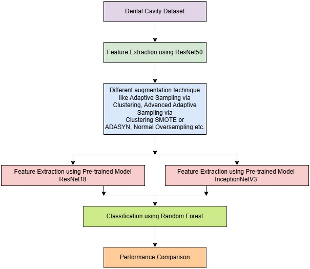
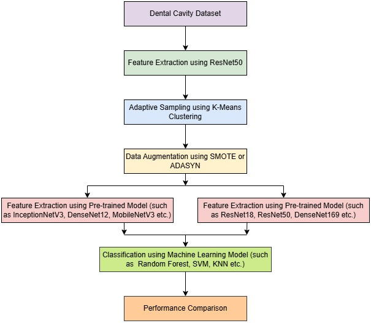

## Advanced Adaptive Sampling Via Clustering
-- An Advanced method to overcome the class imbalance function help in solving the problem of different types of images within a same class like within clean teeth some images show single tooth, upper jaw, lower jaw and whole mouth, it basically helps in managing the directory by increasing these different type of images equally within each class. This method provides the choice of using SMOTE and ADASYN for creating synthetic images (depending on type of dataset).
 

-- Check the dataset at [Dataset](https://www.kaggle.com/datasets/nabeel1921/dental-cavity/data)

-- Check the published paper at [Paper](https://ieeexplore.ieee.org/document/11038766)
